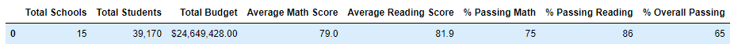
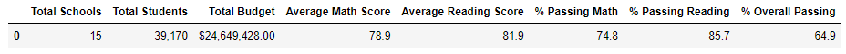
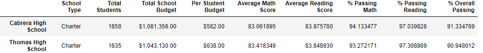
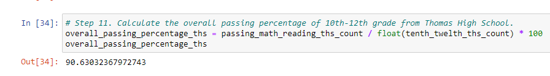
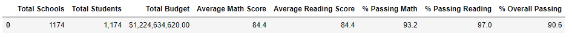

# School_District_Analysis

##### Source:https://gfycat.com/warpedunitedfowl

Overview of the school district analysis: Explain the purpose of this analysis.

The purpose of the **_"PyCitySchools_Challenge.ipynb"_** is to replace the math and reading scores for Thomas High School with NaNs while keeping the rest of the data intact because the **_"students_complete.csv"_** file shows evidence of academic dishonesty; specifically, reading and math grades for Thomas High School ninth graders appear to have been altered.

The associated charts and descriptions for each bulleted list will address the following question.

#### How is the district summary affected?
Excluding the Thomas High Schools 9th grade students Reading and Math scores were slightly affected by tenths of average scores in Average Math Score, Average Reading Score, % Passing Math, % Passing Reading, and % Overall Passing.

#### How is the school summary affected?
In the tables below, the difference when excluding the Thomas High Schools 9th grade students Reading and Math scores are minimum. In this table, the Thomas High School scores without the 9th, slight decrease, for example in % Overall Passing from 90.948012 to 90.630324.  Comparing Thomas High School % Overall Passing placement does not change much either.   

#### How does replacing the ninth graders’ math and reading scores affect Thomas High School’s performance relative to the other schools?
We saw in the table above that replacing ninth graders’ math and reading scores does not affect their % Overall Passing marks. They are still within the 90 percentile passing mark.

#### How does replacing the ninth-grade scores affect the following:
Math and reading scores by grade
Scores by school spending
Scores by school size
Scores by school type
Summary: Summarize four changes in the updated school district analysis after reading and math scores for the ninth grade at Thomas High School have been replaced with NaNs.

